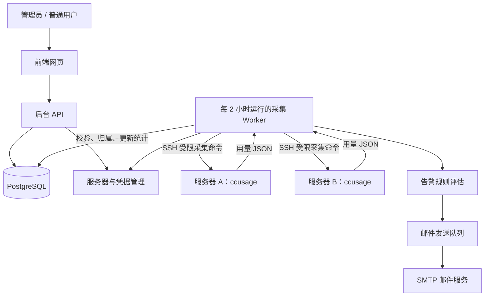

# 基于 ccusage 的多用户用量监控平台项目方案

版本：v1.0  
编写日期：2026-09-19  
状态：方案设计，尚未实施  
默认统计时区：Asia/Shanghai  
用量采集与数据更新周期：每 2 小时一次

## 1. 项目目标

基于 [ccusage](https://github.com/ccusage/ccusage) 构建多服务器、多用户用量监控平台。管理员配置服务器连接凭据和用户映射，系统定期采集使用记录，统一汇总到数据库，通过前端网页展示，并对用量超过阈值的用户发送邮件提醒。

本方案中的“每 2 小时更新一次”指使用量采集、统计结果更新，以及采集后的告警评估，不指自动修改本方案文档。

| 能力 | 具体内容 |
| --- | --- |
| 多服务器接入 | 配置服务器地址、SSH 端口、登录用户名、私钥及数据目录 |
| 多用户管理 | 配置用户姓名、邮箱、所属团队及预算 |
| 跨服务器汇总 | 同一个人在不同服务器上的用量合并统计 |
| 前端展示 | 按用户、服务器、日期、模型筛选，展示排名和趋势 |
| 邮件告警 | 超过每日或每月 Token、估算费用阈值时提醒 |
| 采集状态监控 | 展示最后成功时间、连接失败、权限不足等状态 |

## 2. 数据来源与实施前提

ccusage 分析的是服务器上的本地使用记录，并非通过模型平台账号密码或 API Key 查询账户全部使用量。因此，本方案将“密钥和用户登录”解释为服务器 SSH 私钥、Linux 登录用户名及用户数据目录。

若实际提供的是模型平台 API Key 或平台登录账户，需要另行评估对应的用量接口，不能直接套用 SSH 采集流程。

第一版优先接入 Claude Code，其他工具通过数据源适配器扩展。ccusage 提供 JSON 输出及按日、月、会话统计等能力，平台复用其分析结果。

数据边界：

- 仅统计已接入服务器、已配置目录中实际保留的记录。
- 未采集设备上的使用量、已删除且未入库的记录无法自动恢复。
- 多人共用同一账户和同一数据目录，且记录没有可靠身份字段时，只能归属为共享账户。
- 费用统一标注为“估算费用”，不能直接作为订阅实际扣费或官方剩余额度。
- 默认不上传提示词、回答正文或完整会话日志，仅返回统计字段。

参考：[ccusage 官方介绍](https://ccusage.com/guide/)、[项目 README](https://github.com/ccusage/ccusage)、[费用计算说明](https://ccusage.com/guide/cost-modes)。实现时需固定版本并验证实际输出字段。

## 3. 整体架构

新建管理平台，将固定版本的 ccusage 作为分析组件接入，第一版不深度修改上游代码。



| 模块 | 职责 |
| --- | --- |
| 前端 | 仪表盘、用户详情、服务器配置、告警设置 |
| 后台 API | 登录鉴权、配置管理、统计查询 |
| 采集 Worker | 定时连接服务器、调用 ccusage、处理失败重试 |
| 数据适配层 | 将不同来源的 JSON 转为统一统计结构 |
| 数据库 | 保存用户关系、统计快照、采集状态及告警记录 |
| 邮件 Worker | 异步发送邮件、失败重试、记录发送结果 |

采集和邮件发送由后台任务执行，不占用网页请求处理流程。对于中央平台无法直接连接的服务器，后续可增加主动通过 HTTPS 上报统计数据的轻量 Agent。

## 4. 服务器接入与采集流程

第一版采用 SSH 主动采集。

1. 管理员填写服务器地址、端口、SSH 用户名和私钥。
2. 验证主机指纹，测试连接及目录读取权限。
3. 添加一个或多个采集目标，绑定实际用户和数据目录。
4. 在服务器预装固定版本 ccusage 和受限采集脚本。
5. 首次导入指定范围内的历史统计数据。
6. 后续每 2 小时自动采集一次。
7. 成功结果入库后更新统计，并评估邮件告警。

SSH 登录账户与被统计用户分别管理。一个专用采集账户可以读取多个已授权的用户目录；无法集中授权时，分别配置用户的 SSH 连接。

### 4.1 调度与更新周期

| 项目 | 约定 |
| --- | --- |
| 常规采集周期 | 每 2 小时一次 |
| 调度时点 | Asia/Shanghai 时区每日 00:00、02:00、04:00，依此类推 |
| Cron 表达式 | `0 */2 * * *`，调度器显式配置 Asia/Shanghai 时区 |
| 首次接入 | 连接验证成功后创建一次初始化采集任务 |
| 手动采集 | 管理员可立即触发，不改变常规调度时点 |
| 网页数据 | 展示最近一次成功入库结果，不因打开网页而执行 SSH 采集 |
| 告警评估 | 每次成功采集入库后执行，包括手动采集 |
| 失败重试 | 有限次数退避重试，不必等待下一次两小时调度 |

同一采集目标加锁，避免定时任务、手动采集和重试并发覆盖。多服务器通过有限并发分批执行，控制中央平台与远端服务器负载。

正常运行时，用量变化到触发提醒的等待时间最长约为 2 小时，加上采集及邮件处理耗时；服务器离线或邮件服务异常时可能更久。邮件告警不提供实时性保证。

服务重启后检查遗漏的调度批次，通过补采恢复数据，不为每个遗漏时点重复创建全量任务。

## 5. 用户归属与统计口径

每个人在平台中拥有独立的 `user_id`，通过采集目标绑定远端数据目录。

```text
张三（平台 user_id）
├── 服务器 A / Linux 用户 zhangsan / Claude 数据目录
└── 服务器 B / Linux 用户 developer / Claude 数据目录
```

两个来源汇总到同一个用户，不能直接按 Linux 用户名合并身份。

| 类别 | 字段 |
| --- | --- |
| 归属 | 用户、服务器、采集目标、数据源 |
| 时间 | 统计日期、统计时区、采集时间 |
| 用量 | 输入 Token、输出 Token、缓存读取与写入 Token |
| 分析维度 | 模型；会话与项目维度按数据源能力提供 |
| 费用 | 估算费用、币种、计价模式、价格版本 |
| 状态 | 完整性标记、最近成功采集时间、解析器版本 |

不同来源可能对输入与缓存 Token 采用不同定义，适配器需明确包含关系，避免重复相加。缺失字段显示为“未知”，不直接作为零处理。费用使用定点数，Token 使用大整数。

日、月统计及告警统一使用 Asia/Shanghai 时区，任务时间保存为 UTC。日统计采用自然日，月统计采用自然月。月度统计由每日统计汇总，不叠加另一份月报。

## 6. 防重复、补采与数据完整性

第一版采用“按日期重算、覆盖更新统计快照”，不把每次获取的累计数值直接相加。

- 首次回填配置范围内的历史数据。
- 常规轮询重算当天及最近几天，具体回看天数可配置。
- 以“采集目标 + 数据源 + 日期 + 模型”等完整维度作为唯一键。
- 同一时间范围再次采集时，事务性替换对应完整快照，清理该范围中已失效的维度行。
- 只有完整、校验成功的结果才更新；失败时保留上次成功数据。
- 空结果必须区分“确实没有用量”与“目录缺失、权限异常、解析失败”。
- 定期执行较长时间范围的对账，补齐延迟写入记录。
- 历史日志被清理时，不直接把数据库中已保存的历史统计清零；异常减少需标记并核查。

同一份日志如果复制到多台服务器，聚合 JSON 未必足以进行跨服务器事件去重。第一版要求每份逻辑数据指定唯一采集来源；日志迁移时设置来源切换边界。后续如需自动识别镜像日志，再增加事件级采集与去重。

## 7. 前端功能

| 页面 | 主要内容 |
| --- | --- |
| 总览仪表盘 | 今日/月 Token、估算费用、活跃用户、用量排名、趋势、采集异常 |
| 用户列表 | 姓名、团队、邮箱、今日/月用量、预算使用率、告警状态 |
| 用户详情 | 跨服务器汇总、趋势、模型分布、服务器贡献、告警历史 |
| 服务器管理 | 添加连接、测试连接、配置目录、绑定用户、启停与手动采集 |
| 告警规则 | 指标、阈值、周期、适用用户、收件人 |
| 告警记录 | 触发时间、触发值、阈值、邮件状态、失败原因 |
| 系统设置 | SMTP、统计时区、采集周期、数据保留策略 |

所有统计页面显示最近成功更新时间与下次计划采集时间。部分服务器失联时，保留已有统计并标记数据不完整，不显示成零使用量。

权限分为两类：

- 管理员：管理服务器、用户、凭据和规则，查看全部统计。
- 普通用户：仅查看自己的用量及告警记录。

权限校验在后台执行，不能仅依赖前端隐藏页面。

## 8. 邮件告警

### 8.1 告警规则

以下阈值为示例，实际由管理员配置。

| 规则 | 示例条件 |
| --- | --- |
| 每日 Token 超限 | 当日累计超过 1,000 万 Token |
| 每月 Token 超限 | 当月累计超过 1 亿 Token |
| 每日估算费用超限 | 当日估算费用超过 50 美元 |
| 月度预算提醒 | 达到月预算的 80% 和 100% |

规则可配置用户、团队或全局适用范围，以及用户本人、管理员等收件人。第一版仅提醒，不自动停用账户或终止任务。

### 8.2 触发与去重

1. 采集结果成功入库。
2. 汇总用户所有来源在相关统计周期内的用量。
3. 判断是否达到阈值。
4. 在同一数据库事务内创建告警记录和邮件发送任务。
5. 邮件 Worker 发送并记录结果。

“用户 + 规则 + 统计周期 + 阈值档位”设置唯一键，每个周期的每个档位只创建一次告警。80% 和 100% 可以分别提醒，进入新周期后重新判断。

跨日、跨月补采时，应同时评估本次更新涉及的刚结束周期，避免午夜采集后遗漏上一日最后两小时产生的超限。首次历史回填默认关闭历史告警，避免集中发送过期提醒。

多来源尚未全部更新时，邮件注明数据截至时间和不完整状态；如果已采集用量已超过阈值，可以触发提醒，不能把未达到阈值解读为完整数据下未超限。

发送失败采用有限次数退避重试，最终失败在后台标记。SMTP 在超时后可能存在“服务端已接收但本地未确认”的情况，不能绝对保证收件端只收到一次；使用稳定邮件标识并记录发送状态，减少重复风险。

服务器持续采集失败单独通知管理员，阈值按两小时采集周期配置，例如连续两轮失败。

### 8.3 邮件示例

```text
主题：[用量提醒] 张三本月预算已达到 80%

用户：张三
统计周期：2026-09
本月估算费用：US$ 420
月度预算：US$ 500
预算使用率：84%
数据更新时间：2026-09-19 14:00（Asia/Shanghai）
自动采集周期：每 2 小时

查看详情：https://usage.example.com/users/xxx
```

## 9. 凭据与运行安全

- SSH 私钥加密保存，主加密密钥与数据库分离管理。
- 凭据提交后仅展示标识与指纹，不提供明文回显。
- 使用专用采集账户，限制到指定目录和受限采集命令。
- 验证 SSH 主机指纹，支持密钥轮换与撤销。
- 校验服务器地址、端口和目录参数，禁止拼接任意远程命令。
- 日志及错误信息脱敏，不记录私钥或 SMTP 密码。
- 记录凭据修改、用户绑定、告警规则变更的审计日志。
- 网页使用 HTTPS，邮件连接启用 TLS。
- 数据库定期备份，并验证凭据解密所需密钥的独立恢复流程。

## 10. 推荐技术栈

| 层次 | 建议 |
| --- | --- |
| 前端 | React + TypeScript + Ant Design + ECharts |
| 后端 | Node.js + TypeScript + Fastify |
| 数据库 | PostgreSQL |
| 任务队列 | Redis + BullMQ |
| SSH / 邮件 | ssh2 / Nodemailer |
| 用量解析 | 固定版本 ccusage + JSON 适配器 |
| 部署 | Docker Compose + HTTPS 反向代理 |

部署包含前端/API、采集 Worker、邮件 Worker、PostgreSQL 和 Redis。初期可以部署在同一台管理服务器，后续独立扩展 Worker。具体资源规格在确认用户数量和历史日志规模后，通过样本压测确定。

## 11. 核心数据表

| 表 | 作用 |
| --- | --- |
| `users` | 实际用户、邮箱、角色、团队 |
| `servers` | 服务器地址、主机指纹、启停状态 |
| `credentials` | 加密凭据或外部凭据引用 |
| `collection_targets` | 服务器、目录、数据源与实际用户绑定 |
| `collection_runs` | 采集任务、时间、结果、错误及批次状态 |
| `usage_daily` | 按来源、日期和模型保存统计快照 |
| `alert_rules` | 阈值、周期、适用范围、收件人 |
| `alert_events` | 告警记录及唯一去重键 |
| `email_outbox` | 邮件发送任务、结果和重试状态 |
| `audit_logs` | 管理操作审计 |

用户绑定调整需保留历史归属或提供显式历史重归属操作，不能静默改变已经产生的统计和告警。

## 12. 实施计划

按一名熟悉相关技术的全栈开发者估算，首版约 3～4 周，实际取决于服务器数量、网络权限和日志规模。

| 阶段 | 内容 | 预计时间 |
| --- | --- | --- |
| 技术验证 | 单服务器采集、JSON 字段核对、费用口径、目录权限验证 | 2～3 天 |
| 采集后台 | 多服务器配置、凭据存储、用户绑定、两小时调度、去重入库 | 4～5 天 |
| 前端展示 | 登录、仪表盘、用户详情、服务器管理 | 4～5 天 |
| 邮件告警 | 规则、周期去重、模板、失败重试 | 2～3 天 |
| 联调部署 | 异常场景验证、备份恢复、部署及运维文档 | 3～4 天 |

交付物包括应用源码、数据库迁移、Docker Compose 配置、远端采集脚本、配置示例、部署文档及验收记录。

## 13. 验收标准

- 同一用户在两台服务器上的用量能够正确合并。
- 相同数据重复采集多次，总量不增长。
- 与同版本、同时间范围、同时区及计价配置的 ccusage 输出核对一致。
- 正常情况下每 2 小时创建采集批次，页面在结果入库后展示新统计。
- 断连时展示数据过期，恢复连接后补齐缺失统计。
- 超过阈值后，在下一次成功采集及邮件处理完成后收到提醒。
- 同一周期反复采集不会反复创建同一档位告警。
- 跨日、跨月采集能够识别刚结束周期的超限。
- 首次历史回填不会集中发送历史告警。
- 普通用户无法访问他人用量或任何服务器凭据。
- 重启、任务重试和并发采集不会造成重复累计或旧结果覆盖新结果。

## 14. 开发前需要明确的信息

1. 实际需要接入的工具类型，首版是否仅支持 Claude Code。
2. 服务器数量、用户数量及历史日志规模。
3. 中央平台能否通过 SSH 访问各服务器，是否需要跳板机。
4. 是否存在共享账户、共享目录、镜像日志或用户跨服务器迁移。
5. 用户对应关系、告警阈值、收件人及 SMTP 配置方式。
6. 历史回填范围、统计数据保留期限及部署域名。

方案阶段无需提供真实私钥。真实凭据应在实施后的受控配置入口中录入。
