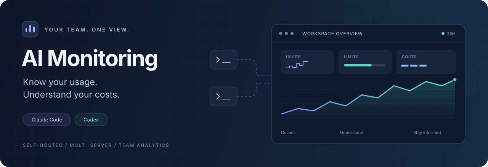
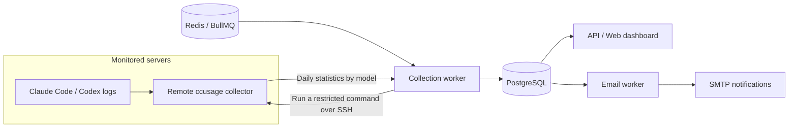

<div align="center">



# AI Monitoring

[简体中文](README.md) · **English**

**Bring AI coding usage across your servers into one clear team dashboard.**

Claude Code · Codex · Multiple users and servers · Usage, limits and billing

[](server/package.json)
[](web/package.json)
[](docker-compose.yml)
[](docker-compose.yml)

[Features](#features) · [Quick start](#quick-start) · [Examples](#examples) · [FAQ](#faq) · [Operations guide (中文)](docs/DEPLOY.md)

</div>

---

AI Monitoring is a self-hosted usage dashboard for AI coding tools. It runs [ccusage](https://github.com/ryoppippi/ccusage) on your servers over SSH, collects daily statistics by model, and brings them together so you can see who is using what, how much it costs, and whether a budget needs attention.

Designed for research labs, development teams, and individuals managing multiple accounts and machines. The web interface currently uses Chinese and supports mobile browsers; this README and the example guide are available in both languages.

## Features

| | Capability | What you can do |
| :---: | --- | --- |
| 📊 | Usage dashboard | Track tokens, estimated costs, model distribution, trends and a daily top 10 user ranking |
| 🖥️ | Multiple servers | Collect Claude Code and Codex usage over SSH and aggregate each user's usage across machines |
| 👥 | Users and ownership | Manage teams, monthly budgets, shared accounts and source date boundaries; preserve historical ownership when reassigning targets |
| ⏳ | Subscription limits | View provider-reported usage windows, utilization and reset times, with account-level deduplication across servers |
| 🔔 | Email alerts | Set daily/monthly token, estimated cost, budget percentage and account-limit alerts; notify administrators after repeated collection failures |
| 🧾 | Expense ledger | Record actual bills and receipt images, summarize monthly spending, and configure exchange rates and the starting month |
| 🔄 | Recovery and reconciliation | Schedule collection, retry failures and backfill after reconnecting, without counting repeated snapshots twice |
| 🔐 | Access and credentials | Separate admin and user access, encrypt SSH keys and SMTP passwords, and audit important operations |

> [!NOTE]
> **Estimated usage costs, subscription limits and actual bills are different measurements.** ccusage estimates do not represent subscription charges. Limits come from provider endpoints, while actual spending is recorded in the ledger.

## How it works



- **Collection runs every two hours by default**, using `Asia/Shanghai`. Change the interval and reporting timezone in settings.
- **Pages read stored results**. Opening the dashboard does not initiate SSH connections to every server.
- **Statistics are computed remotely**. Usage collection does not upload prompts, responses or raw conversations to the central platform.
- **Failures preserve the last successful data** and mark it stale. Recovery backfills available logs within the configured history range.
- **Snapshots replace previous results instead of accumulating duplicates**. If remote log cleanup reduces usage, the platform preserves previous values and flags the change for review.

## Quick start

### Docker Compose

You need Docker Engine, the Compose plugin, and a domain pointing to your deployment host. The included Caddy configuration serves HTTPS and requires ports 80 and 443.

**1. Clone the repository and copy the configuration template**

```bash
git clone https://github.com/Lin-zikai/AI_monitoring.git
cd AI_monitoring
cp .env.example .env
```

**2. Edit `.env`**

| Variable | Purpose |
| --- | --- |
| `SITE_DOMAIN` | Your domain, such as `usage.example.com` |
| `PUBLIC_BASE_URL` | Full URL, such as `https://usage.example.com`, used in email links |
| `POSTGRES_PASSWORD` | Database password; generate a URL-safe value with `openssl rand -hex 24` |
| `JWT_SECRET` | Session signing secret; generate with `openssl rand -hex 32` |
| `ADMIN_EMAIL` | Administrator email for the initial account |
| `ADMIN_PASSWORD` | Initial administrator password of your choice, at least 10 characters |

See [.env.example](.env.example) for the remaining options.

**3. Generate the encryption key and start the services**

Run this only for a new deployment; retain the existing key when upgrading.

```bash
mkdir -p secrets
(umask 077; openssl rand -base64 32 > secrets/master_key)
docker compose up -d --build
docker compose logs -f api collector mailer
```

Open your HTTPS URL and sign in with the administrator account. Change the password after the first login, then remove `ADMIN_PASSWORD` from `.env`.

> [!IMPORTANT]
> `secrets/master_key` decrypts saved SSH credentials and SMTP passwords. Back it up separately from the database. Losing or replacing it makes existing credentials unreadable. The [operations guide (Chinese)](docs/DEPLOY.md) covers private certificates, backups, restores and key rotation.

### Try it locally without Docker

Requires Linux, Node.js 20.19+ within the 20.x line or 22.12+, npm, and `redis-server`. The script installs dependencies, builds the application, and starts a separate embedded PostgreSQL instance, Redis and the application processes.

```bash
scripts/local-run.sh start
scripts/local-run.sh status
# When finished: scripts/local-run.sh stop
```

Visit `http://localhost:3000`. Initial administrator credentials are stored in `.local-run/env`; logs are in `.local-run/logs/`. Use `REDIS_SERVER_BIN` to specify the Redis executable if needed.

This mode binds to `0.0.0.0:3000` over plain HTTP by default. Use it on a trusted local network; use HTTPS for a production deployment.

## Connect your servers

The labels below include the current Chinese UI text to help you find each screen.

1. **Create users** in 用户列表 (Users). Optionally assign a team and monthly budget.
2. **Add a server** in 服务器管理 (Server management). Enter the address, SSH port, username and private key, then select its owner. The platform records the initial host fingerprint, checks or installs the collector, and creates targets for both data sources.
3. **Check data directories** against the locations actually used by the remote account. Run 测试目录 (Test directory) and a manual collection.
4. **Configure alerts**. Set up SMTP in 系统设置 (Settings), then configure usage thresholds or account-limit reminders in 告警规则 (Alert rules).

| Source | Common default | Custom location |
| --- | --- | --- |
| Claude Code | `<user-home>/.claude` | The actual `CLAUDE_CONFIG_DIR` value |
| Codex | `<user-home>/.codex` | The actual `CODEX_HOME` value |

A user's home directory is not always `/home/<username>`. Verify paths particularly when using restricted SSH keys, nonstandard home directories or custom environment variables.

For tighter remote permissions, manually install a dedicated account with an SSH forced command and a directory allowlist. See the [English configuration example](docs/EXAMPLES.en.md) and the [full deployment guide (Chinese)](docs/DEPLOY.md) for installation modes and permissions.

## Examples

Consider a lab where Alice uses Claude Code and Codex on two servers, while Bob uses Codex on another. Assign Alice's targets to the same platform user to aggregate her usage across machines.

| Platform user | Server | SSH user | Data directory | Source |
| --- | --- | --- | --- | --- |
| Alice | `gpu-01` | `alice` | `/home/alice/.claude` | Claude Code |
| Alice | `cpu-01` | `alice` | `/data/alice/codex` | Codex |
| Bob | `dev-01` | `bob` | `/home/bob/.codex` | Codex |

These are fictional examples; replace the accounts and paths with your own. If Alice's machines report 1.2 million and 0.8 million tokens for the same day, her combined total is 2 million tokens.

Set Alice's monthly budget to **US$100** and create a monthly budget percentage rule with tiers **80 and 100**. Once collection brings her estimated cost to a threshold, the platform can email the configured recipients. Configure SMTP first.

| Resource | Contents |
| --- | --- |
| [English examples](docs/EXAMPLES.en.md) / [中文示例](docs/EXAMPLES.md) | Multiple servers, custom paths, budget alerts, remote configuration and expected results |
| [Remote collector configuration](examples/collector.config.json) | Allow a default Claude directory and a custom Codex directory; account-limit queries are disabled by default |
| [Monthly budget rule body](examples/monthly-budget-rule.json) | An 80% / 100% monthly budget rule for the admin API |

The JSON files are configuration/request templates, not a demo database. They do not automatically import users, servers or usage. See the example guide for instructions.

## FAQ

<details>
<summary><strong>Why does a target show “未使用” (not in use) when I am using the tool?</strong></summary>

This status means the configured directory does not exist and the target allows a missing directory. It does not establish that the user has no usage.

Check the real home directory and `CODEX_HOME` / `CLAUDE_CONFIG_DIR`, correct the target path, and run a manual collection. In this state, the last successful collection time can simply mean the directory check completed. Inactive sources are normally probed once a day rather than on every collection cycle.

</details>

<details>
<summary><strong>Why do multiple targets report SSH connection timeouts together?</strong></summary>

Check whether they share a machine or network path, then check the SSH port, server connectivity and any VPN or tunnel. `CONNECT_TIMEOUT` indicates a connection-stage timeout; `EXEC_TIMEOUT` indicates a remote command execution timeout.

The platform retains previous results while disconnected and backfills on the next successful collection. Historical alerts remain after recovery; inspect server management for the current status.

</details>

<details>
<summary><strong>Why does usage collection work while subscription limits are unavailable?</strong></summary>

Usage is read from local session logs. Limit queries require a valid subscription login token on the remote host and connectivity to the provider. API-key accounts do not expose the same subscription limit information.

The platform does not refresh CLI login tokens or transfer them to the central server. Provider limit endpoints may change. The [operations guide (Chinese)](docs/DEPLOY.md) explains the current behavior and limitations.

</details>

<details>
<summary><strong>Will repeated collection count the same usage twice?</strong></summary>

Statistics are stored as snapshots keyed by target, source, date and model. Collecting the same result again does not accumulate duplicate usage. When migrating logs between targets, configure source start/end dates to avoid counting the same history under two targets.

Estimated costs are for monitoring and budgeting, not actual charges.

</details>

## Development and verification

```bash
npm --prefix server ci
npm --prefix web ci

# Type checking and frontend build
npm --prefix server run typecheck
npm --prefix web run build

# Backend unit, API, collection and SSH integration tests
npm --prefix server test
```

Tests use a temporary embedded PostgreSQL instance by default and do not need the production database or Redis. Alternatively, set `TEST_DATABASE_URL` to a dedicated test instance with permission to create databases.

Development services need PostgreSQL, Redis and environment variables including `DATABASE_URL`, `REDIS_URL`, `MASTER_KEY` and `JWT_SECRET`. Set `COOKIE_SECURE=false` for local HTTP, and `ADMIN_EMAIL` / `ADMIN_PASSWORD` for initial setup. Run each command in a separate terminal with the same environment:

```bash
npm --prefix server run dev:api
npm --prefix server run dev:collector
npm --prefix server run dev:mailer
npm --prefix web run dev
```

The frontend development server proxies `/api` to port `3000` on localhost. The [acceptance report (Chinese)](docs/ACCEPTANCE.md) documents earlier verification; its dates and test counts refer to that historical version.

## Project structure

```text
AI_monitoring/
├── web/                  React · Ant Design · ECharts
├── server/
│   ├── src/api/          Fastify API and authorization
│   ├── src/collect/      Collection, backfill and snapshots
│   ├── src/alerts/       Alert evaluation and email templates
│   ├── src/mail/         Email outbox and delivery
│   ├── migrations/      PostgreSQL migrations
│   └── test/            Unit and integration tests
├── remote/               Remote collector and installer
├── examples/             Configuration and API body templates
├── scripts/              Local runtime tools
├── deploy/               Caddy configuration
├── docs/                 Guides, examples and verification notes
└── docker-compose.yml    Full service deployment
```

## Boundaries and data protection

- The collection worker must be able to reach each server directly over SSH. Jump hosts are not supported.
- This is periodic monitoring; notifications are subject to collection and processing delays.
- If several people share one tool account and log directory, usage can only be attributed to the whole source, not reconstructed per person.
- Remote collector accounts need access to session logs. Usage collection returns aggregate statistics; optional account-limit queries also return account identifiers, limit information and plan metadata.
- SSH keys and SMTP passwords use AES-256-GCM encryption with a separately managed master key. Host fingerprints are recorded on first connection; subsequent mismatches are rejected.
- Keep `.env`, `secrets/`, `.local-run/`, runtime logs and build output out of version control.

---

<div align="center">

[Examples](docs/EXAMPLES.en.md) · [中文文档](README.md) · [Operations (中文)](docs/DEPLOY.md) · [Design (中文)](PROJECT_PLAN.md) · [Report an issue](https://github.com/Lin-zikai/AI_monitoring/issues)

Built with [ccusage](https://github.com/ryoppippi/ccusage), React, Fastify and PostgreSQL.

</div>
