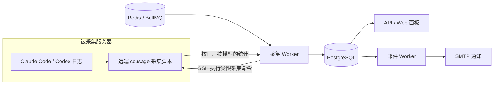

<div align="center">


# AI Monitoring

**简体中文** · [English](README.en.md)

**把分散在多台服务器上的 AI 编程用量，汇总成一张清晰的团队账本。**

Claude Code · Codex · 多用户与多服务器 · 用量、额度与账单

[](server/package.json)
[](web/package.json)
[](docker-compose.yml)
[](docker-compose.yml)

[功能概览](#功能概览) · [快速部署](#快速部署) · [使用示例](#使用示例) · [常见问题](#常见问题) · [运维文档](docs/DEPLOY.md)

</div>

---

AI Monitoring 是一个可自行部署的 AI 编程工具用量监控平台。它通过 SSH 在各服务器上运行 [ccusage](https://github.com/ryoppippi/ccusage)，将按日、按模型的统计汇总到中央面板，帮助团队看清谁在使用、用了多少、预算是否超限。

适合实验室、研发团队，以及同时管理多个账户和多台机器的个人。支持中文界面和手机浏览。

## 功能概览

| | 能力 | 你可以做什么 |
| :---: | --- | --- |
| 📊 | 用量总览 | 查看 Token、估算费用、模型分布、趋势，以及按日期切换的用户 Top 10 |
| 🖥️ | 多服务器采集 | 通过 SSH 接入 Claude Code 与 Codex，同一用户的多台服务器用量自动汇总 |
| 👥 | 用户与归属管理 | 管理团队、月预算、共享账户、来源日期边界；调整绑定时保留历史归属 |
| ⏳ | 订阅账号额度 | 按账号展示服务商返回的额度窗口、已用比例和刷新时间，同账号跨服务器去重查询 |
| 🔔 | 邮件提醒 | 配置日/月 Token、估算费用、预算百分比及账号额度提醒，连续采集失败时通知管理员 |
| 🧾 | 实际支出账本 | 记录账单与截图，按月汇总支出，设置汇率与记账起始月份 |
| 🔄 | 自动补采与对账 | 定时采集、失败重试、断连恢复后补采；重复采集不会重复累计 |
| 🔐 | 权限与凭据管理 | 管理员与普通用户隔离，SSH 私钥和 SMTP 密码加密保存，关键操作留有审计记录 |

> [!NOTE]
> **用量估算、订阅额度和实际账单是三种不同的数据。** ccusage 的估算费用不等于订阅实际扣款；账号额度来自服务商接口；实际支出由账本记录。

## 如何工作



- **默认每 2 小时采集**，统计时区默认为 `Asia/Shanghai`，可以在系统设置中调整。
- **页面读取已入库的数据**，浏览面板不会临时连接所有服务器。
- **统计在远端生成**，用量采集不会向中央平台上传提示词、回答或原始会话内容。
- **失败时保留上次成功数据**，显示过期状态；恢复后自动补采仍在回溯范围内的日志。
- **按快照更新，不累加重复结果**；日志被清理导致用量减少时保留旧值并提示核对。

## 快速部署

### Docker Compose

准备 Docker Engine、Compose 插件，以及指向部署机器的域名。默认使用 Caddy 提供 HTTPS，需开放 80 / 443 端口。

**1. 获取代码和配置模板**

```bash
git clone https://github.com/Lin-zikai/AI_monitoring.git
cd AI_monitoring
cp .env.example .env
```

**2. 填写 `.env`**

| 配置项 | 说明 |
| --- | --- |
| `SITE_DOMAIN` | 访问域名，例如 `usage.example.com` |
| `PUBLIC_BASE_URL` | 完整访问地址，例如 `https://usage.example.com`，用于邮件链接 |
| `POSTGRES_PASSWORD` | 数据库密码；使用 `openssl rand -hex 24` 生成 URL 安全的值 |
| `JWT_SECRET` | 会话签名密钥；使用 `openssl rand -hex 32` 生成 |
| `ADMIN_EMAIL` | 首次启动创建的管理员邮箱 |
| `ADMIN_PASSWORD` | 自行设置的初始管理员密码，至少 10 位 |

其余配置见 [.env.example](.env.example)。

**3. 创建凭据加密密钥并启动**

首次部署时执行；已有部署请保留原密钥。

```bash
mkdir -p secrets
(umask 077; openssl rand -base64 32 > secrets/master_key)
docker compose up -d --build
docker compose logs -f api collector mailer
```

打开配置的 HTTPS 地址，使用管理员账户登录。首次登录后修改密码，并删除 `.env` 中的 `ADMIN_PASSWORD`。

> [!IMPORTANT]
> `secrets/master_key` 用于解密已保存的 SSH 凭据和 SMTP 密码，请与数据库分别备份。更换或丢失它会导致原凭据无法解密。内网证书、备份恢复与密钥轮换见[部署文档](docs/DEPLOY.md)。

### 不使用 Docker 的本机试用

需要 Linux、Node.js 20.19+（20.x）或 22.12+、npm 与 `redis-server`。脚本会安装项目依赖、构建前后端，并启动独立的嵌入式 PostgreSQL、Redis 和应用进程。

```bash
scripts/local-run.sh start
scripts/local-run.sh status
# 结束试用时：scripts/local-run.sh stop
```

默认访问 `http://localhost:3000`。初始管理员账户及随机密码保存在 `.local-run/env`，运行日志位于 `.local-run/logs/`。可以用 `REDIS_SERVER_BIN` 指定 Redis 可执行文件。

此方式默认监听 `0.0.0.0:3000`，使用明文 HTTP，适合可信内网试用；正式部署建议使用 HTTPS。

## 接入服务器

1. **创建用户**：在“用户列表”中添加需要统计的人，按需设置团队和月预算。
2. **添加服务器**：填写地址、SSH 端口、登录用户和私钥，选择归属用户。平台会记录首次连接的主机指纹、检查或安装采集组件，并创建两个数据源的目标。
3. **核对数据目录**：确认指向该账户实际使用的目录，执行“测试目录”与手动采集。
4. **配置提醒**：在“系统设置”中配置 SMTP，再到“告警规则”中设置用量阈值或账号额度提醒。

| 数据源 | 常见默认目录 | 自定义目录 |
| --- | --- | --- |
| Claude Code | `<用户主目录>/.claude` | 以实际 `CLAUDE_CONFIG_DIR` 为准 |
| Codex | `<用户主目录>/.codex` | 以实际 `CODEX_HOME` 为准 |

用户主目录不一定是 `/home/<用户名>`。使用受限 SSH 密钥、非标准主目录或自定义环境变量时，尤其需要核对路径。

需要限制远端权限时，可以手工部署专用账户，使用 SSH `forced command` 和目录白名单。自动安装、无 root 部署、读取权限及账号额度授权方式见[被采集服务器配置](docs/DEPLOY.md#3-被采集服务器)。

## 使用示例

以一个实验室为例：Alice 在两台服务器使用 Claude Code 和 Codex，Bob 在另一台服务器使用 Codex。将 Alice 的采集目标绑定到同一个平台用户，即可跨服务器汇总她的用量。

| 平台用户 | 服务器 | SSH 登录 | 数据目录 | 数据源 |
| --- | --- | --- | --- | --- |
| Alice | `gpu-01` | `alice` | `/home/alice/.claude` | Claude Code |
| Alice | `cpu-01` | `alice` | `/data/alice/codex` | Codex |
| Bob | `dev-01` | `bob` | `/home/bob/.codex` | Codex |

上表是虚构示例，需替换为你自己的账户和路径。如果 Alice 当天两台机器分别产生 120 万和 80 万 Token，个人总览将合计显示 200 万 Token。

将 Alice 的月预算设为 **US$100**，再创建“月预算百分比”规则，档位填 **80、100**，可以在采集后的估算费用达到对应档位时收到提醒。SMTP 需先配置完成。

| 示例资源 | 内容 |
| --- | --- |
| [完整中文示例](docs/EXAMPLES.md) / [English examples](docs/EXAMPLES.en.md) | 多机接入、自定义目录、预算告警、远端配置与预期结果 |
| [远端采集配置](examples/collector.config.json) | 同时允许 Claude 默认目录与 Codex 自定义目录，默认关闭账号额度查询 |
| [月预算告警请求体](examples/monthly-budget-rule.json) | 管理 API 可用的 80% / 100% 月预算规则示例 |

JSON 文件是配置 / 请求体模板，不是演示数据库；不会自动导入用户、服务器或用量。具体使用方式见示例文档。

## 常见问题

<details>
<summary><strong>明明在使用，为什么显示“未使用”？</strong></summary>

“未使用”表示配置的数据目录不存在，且目标开启了“目录不存在视为未使用”。它不等于已经确认该用户没有用量。

请检查登录账户的真实主目录、`CODEX_HOME` / `CLAUDE_CONFIG_DIR`，修改目标路径后手动采集。此时“最近成功采集”可能只是目录检查完成的时间。未使用的目标默认每天探测一次，不参与常规轮询。

</details>

<details>
<summary><strong>多个目标同时报 SSH 连接超时怎么办？</strong></summary>

先检查它们是否共用同一台机器或同一条网络链路，再检查 SSH 端口、服务器外网连接、VPN / 隧道状态。`CONNECT_TIMEOUT` 表示连接阶段超时；`EXEC_TIMEOUT` 表示远端命令执行超时。

断连期间保留上次成功数据；恢复后下一轮自动补采。历史告警不会因恢复而消失，当前状态应在服务器管理页查看。

</details>

<details>
<summary><strong>为什么用量正常，但订阅账号额度查不到？</strong></summary>

两者的来源不同：用量统计读取本地会话日志；额度查询需要远端有效的订阅登录令牌及到服务商的网络连接。API Key 账户没有相同的订阅额度信息。

平台不替 CLI 刷新登录令牌，也不把令牌传回中央服务器。额度接口可能随服务商调整而变化，具体说明见[部署文档的账号额度章节](docs/DEPLOY.md)。

</details>

<details>
<summary><strong>重新采集会不会重复计费？</strong></summary>

平台按“目标 + 数据源 + 日期 + 模型”更新统计快照，同一份结果重复采集不会重复累加。迁移日志到新目标时，请设置来源开始 / 结束日期，避免不同目标之间重复统计。

估算费用仅用于观察和预算管理，不是实际扣款。

</details>

## 本地开发与验证

```bash
npm --prefix server ci
npm --prefix web ci

# 类型检查与前端构建
npm --prefix server run typecheck
npm --prefix web run build

# 后端单元、API、采集与 SSH 集成测试
npm --prefix server test
```

测试默认使用临时嵌入式 PostgreSQL，无需连接生产数据库或 Redis；也可通过 `TEST_DATABASE_URL` 指定具有创建数据库权限的独立测试实例。

开发服务需要 PostgreSQL、Redis，以及 `DATABASE_URL`、`REDIS_URL`、`MASTER_KEY`、`JWT_SECRET` 等环境变量。本地 HTTP 开发设 `COOKIE_SECURE=false`，首次启动设 `ADMIN_EMAIL` / `ADMIN_PASSWORD`。在共享同一配置的终端中分别运行：

```bash
npm --prefix server run dev:api
npm --prefix server run dev:collector
npm --prefix server run dev:mailer
npm --prefix web run dev
```

前端开发服务器将 `/api` 请求代理到本机 `3000` 端口。历史验证范围见[验收记录](docs/ACCEPTANCE.md)，该文档中的日期和测试数量对应当时的版本。

## 项目结构

```text
AI_monitoring/
├── web/                  React · Ant Design · ECharts
├── server/
│   ├── src/api/          Fastify API 与权限校验
│   ├── src/collect/      采集、补采与快照入库
│   ├── src/alerts/       告警评估与邮件模板
│   ├── src/mail/         邮件发件箱与投递
│   ├── migrations/      PostgreSQL 数据库迁移
│   └── test/            单元与集成测试
├── remote/               远端采集脚本与安装工具
├── examples/             可复用的配置与 API 请求体示例
├── scripts/              本机运行工具
├── deploy/               Caddy 配置
├── docs/                 部署、运维与验收文档
└── docker-compose.yml    完整服务编排
```

## 边界与数据保护

- 采集端需要能够直接 SSH 连接目标服务器，目前不支持跳板机。
- 这是周期性统计平台，提醒存在采集周期和处理时间带来的延迟。
- 多人共用同一个工具账户与日志目录时，只能按整个来源归属统计，无法还原每个人的使用量。
- 远端采集账户需要读取会话日志；中央平台只接收用量统计。可选的账号额度功能还会回传账号标识、额度和套餐信息。
- SSH 私钥、SMTP 密码使用 AES-256-GCM 加密保存，主密钥独立管理。首次连接自动记录主机指纹，后续不匹配会拒绝连接。
- `.env`、`secrets/`、`.local-run/`、运行日志及构建产物不应提交到仓库。

---

<div align="center">

[使用示例](docs/EXAMPLES.md) · [English](README.en.md) · [部署与运维](docs/DEPLOY.md) · [设计方案](PROJECT_PLAN.md) · [验收记录](docs/ACCEPTANCE.md) · [反馈问题](https://github.com/Lin-zikai/AI_monitoring/issues)

Built with [ccusage](https://github.com/ryoppippi/ccusage), React, Fastify and PostgreSQL.

</div>
